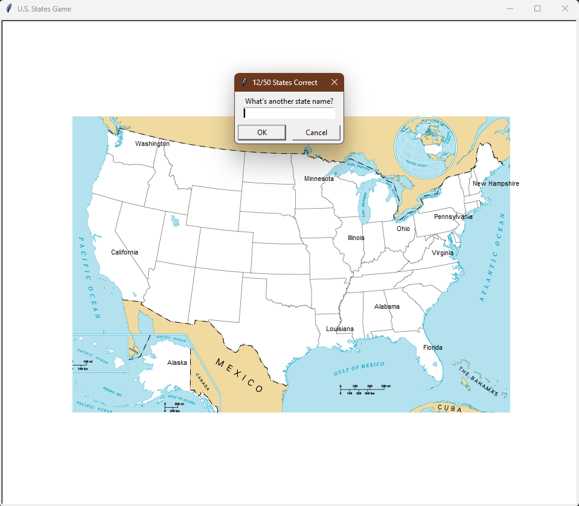

# U.S. States Game

Um jogo interativo em Python para adivinhar os 50 estados dos Estados Unidos.  
O jogo usa a biblioteca **Turtle** para exibir o mapa e **Pandas** para manipular os dados do CSV.

## 🎮 Recursos
- Exibição de um mapa dos EUA com Turtle
- Entrada interativa para adivinhar os estados
- Quando o jogador acerta, o nome aparece no mapa na posição correta
- Salva em `states_to_learn.csv` os estados que não foram adivinhados (para estudar depois)
- Contagem dinâmica de quantos estados já foram encontrados

## ▶️ Como executar
1. Certifique-se de ter o **Python 3** instalado
2. Instale a dependência pandas:
```bash
pip install pandas
```
3. Execute o jogo com:
```bash
python main.py
```

## 📁 Estrutura do projeto
- `main.py` — Arquivo principal do jogo
- `50_states.csv` — Contém os nomes e coordenadas (x, y) dos estados
- `blank_states_img.gif` — Imagem base do mapa dos EUA
- `states_to_learn.csv` — Gerado automaticamente com os estados que o jogador não conseguiu adivinhar

## 🧠 Objetivo educacional
Este projeto foi desenvolvido como prática para:
- Manipulação de arquivos CSV com **Pandas**
- Uso da biblioteca **Turtle** para gráficos
- Estruturação de jogos interativos em Python
- Controle de loops e condições
- Versionamento de projetos com Git/GitHub

## 🖼️ Exemplo de execução


---

👨‍💻 Desenvolvido por Giovanni Cabral
